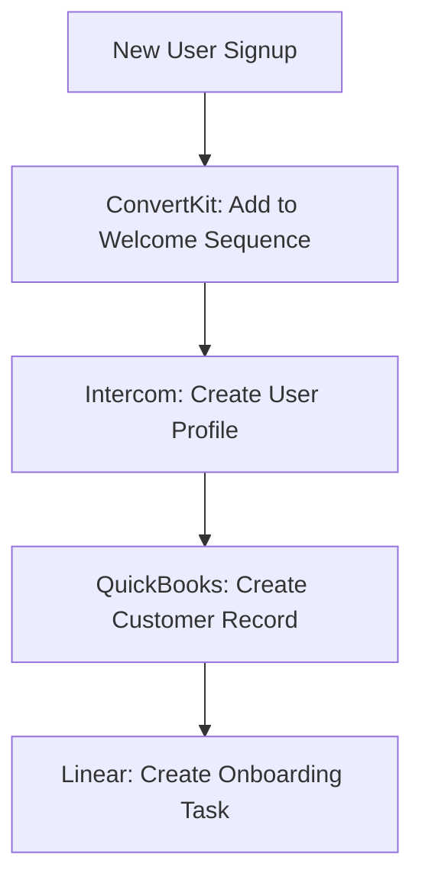
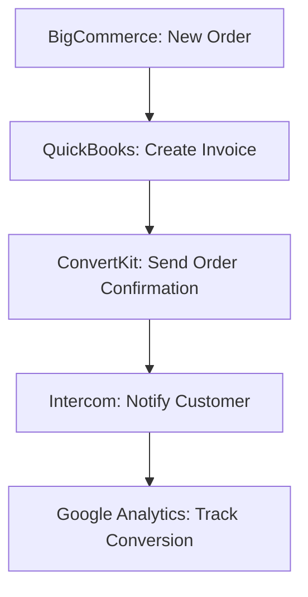
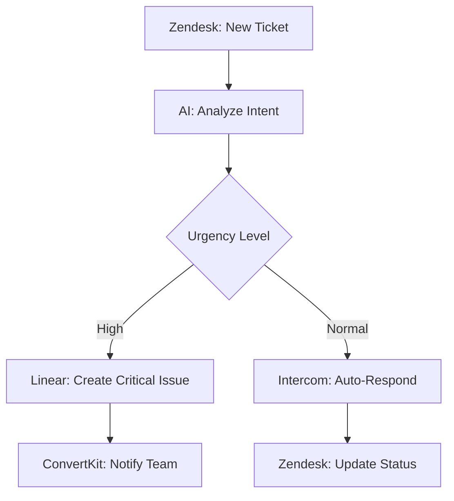

# AI Agent Guide - n8n MCP Server

## Overview

The n8n MCP Server provides a comprehensive interface for AI agents to create, manage, and execute n8n workflows. This server includes 7 high-quality nodes covering essential business automation scenarios, with complete TypeScript implementation and AI-friendly documentation.

## Quick Start for AI Agents

### 1. Available Node Categories

**E-commerce & Finance (2 nodes)**
- `bigcommerce`: Complete e-commerce platform integration
- `quickbooks`: Financial management and accounting

**Marketing & Analytics (2 nodes)**
- `convertkit`: Email marketing automation
- `googleAnalytics`: Web analytics and reporting

**Customer Support (3 nodes)**
- `intercom`: Customer messaging and support
- `intercomTrigger`: Real-time Intercom event triggers
- `zendesk`: Comprehensive support ticket management

**Project Management (1 node)**
- `linear`: Issue tracking and project management

### 2. Node Discovery Commands

```bash
# Search for nodes by functionality
discover_nodes --query="email marketing"
discover_nodes --query="customer support" 
discover_nodes --query="analytics"

# Get detailed node information
get_node_info --node_name="n8n-nodes-base.convertkit"
get_node_info --node_name="n8n-nodes-base.intercom"

# Find nodes by category
discover_nodes --category="ecommerce"
discover_nodes --category="customerSupport"
```

### 3. Common AI Agent Patterns

#### Pattern 1: Customer Support Automation
```yaml
Trigger: intercomTrigger (new conversation)
↓
Action: openai (classify inquiry)
↓
Condition: if urgent → zendesk (create high-priority ticket)
           else → intercom (auto-reply)
```

#### Pattern 2: E-commerce Analytics Pipeline
```yaml
Trigger: schedule (daily)
↓
Data: bigcommerce (get orders)
↓
Analysis: googleAnalytics (track conversions)
↓
Action: convertkit (send performance report)
```

#### Pattern 3: Project Management Integration
```yaml
Trigger: zendesk (ticket created)
↓
Action: linear (create issue)
↓
Update: intercom (notify customer of tracking)
```

## Node Reference Guide

### BigCommerce Node
**Purpose**: E-commerce store management
**Key Operations**: products, orders, customers, categories
**Best For**: Inventory management, order processing, customer data sync

```typescript
// Example: Get recent orders
{
  "resource": "order",
  "operation": "getAll",
  "filters": {
    "dateCreated": "last_week"
  },
  "options": {
    "limit": 50
  }
}
```

### ConvertKit Node
**Purpose**: Email marketing automation
**Key Operations**: subscribers, campaigns, forms, sequences
**Best For**: Newsletter management, automated email sequences

```typescript
// Example: Add subscriber to sequence
{
  "resource": "subscriber",
  "operation": "create",
  "email": "user@example.com",
  "firstName": "John",
  "addToSequence": "welcome_series"
}
```

### Google Analytics Node
**Purpose**: Web analytics and reporting
**Key Operations**: reports, real-time data, metrics analysis
**Best For**: Traffic analysis, conversion tracking, performance monitoring

```typescript
// Example: Get page views by country
{
  "resource": "report",
  "operation": "run",
  "dimensions": [{"name": "country"}],
  "metrics": [{"name": "screenPageViews"}],
  "dateRanges": [{
    "startDate": "7daysAgo",
    "endDate": "today"
  }]
}
```

### Intercom Node
**Purpose**: Customer messaging and support
**Key Operations**: conversations, users, companies, events
**Best For**: Customer communication, user management, event tracking

```typescript
// Example: Reply to conversation
{
  "resource": "conversation",
  "operation": "reply",
  "conversationId": "12345",
  "messageBody": "Thank you for contacting us!",
  "messageType": "comment"
}
```

### Linear Node  
**Purpose**: Issue tracking and project management
**Key Operations**: issues, projects, teams, comments
**Best For**: Bug tracking, feature requests, project organization

```typescript
// Example: Create issue
{
  "resource": "issue",
  "operation": "create",
  "title": "New feature request",
  "description": "Add dark mode support",
  "priority": "high",
  "teamId": "team_123"
}
```

### QuickBooks Node
**Purpose**: Financial management and accounting
**Key Operations**: customers, invoices, payments, reports
**Best For**: Invoicing, expense tracking, financial reporting

```typescript
// Example: Create invoice
{
  "resource": "invoice",
  "operation": "create",
  "customerId": "customer_123",
  "lineItems": [{
    "description": "Consulting Services",
    "amount": 1500.00,
    "quantity": 1
  }]
}
```

### Zendesk Node
**Purpose**: Customer support and ticket management
**Key Operations**: tickets, users, organizations, articles
**Best For**: Support ticket handling, knowledge base management

```typescript
// Example: Create support ticket
{
  "resource": "ticket",
  "operation": "create",
  "subject": "Login Issue",
  "description": "User cannot access account",
  "priority": "high",
  "status": "open",
  "requesterId": "user_456"
}
```

## Advanced AI Agent Workflows

### 1. Automated Customer Onboarding


### 2. E-commerce Order Processing


### 3. Support Ticket Resolution


## AI Agent Best Practices

### 1. Node Selection Strategy
- **Start Simple**: Begin with 1-2 nodes per workflow
- **Identify Triggers**: Choose appropriate trigger nodes for automation
- **Plan Data Flow**: Map how data moves between nodes
- **Error Handling**: Include fallback paths for failures

### 2. Parameter Optimization
- **Use Variables**: Reference previous node outputs with `{{ $json.field }}`
- **Batch Operations**: Use bulk endpoints when processing multiple items
- **Filter Early**: Apply filters to reduce API calls and processing time
- **Cache Results**: Store frequently accessed data to improve performance

### 3. Authentication Management
- **API Keys**: Most nodes require API authentication
- **OAuth2**: Some services (Google, Intercom) use OAuth2 flow
- **Test Credentials**: Always validate credentials before deployment
- **Secure Storage**: Use n8n's credential management for API keys

### 4. Workflow Design Patterns
- **Linear Flow**: Simple A→B→C progression for straightforward automation
- **Conditional Branching**: Use IF nodes for decision-making logic
- **Error Recovery**: Include error-handling nodes for robust workflows
- **Parallel Processing**: Split workflows for independent operations

## Troubleshooting Common Issues

### Node Connection Errors
```bash
# Test node connectivity
test_credential --credential_id="your_credential_id"

# Validate node configuration
validate_node --node_name="n8n-nodes-base.intercom"
```

### Data Format Issues
```bash
# Check expected input format
get_node_info --node_name="n8n-nodes-base.googleAnalytics" --show_examples=true

# Validate workflow structure
validate_workflow --workflow_id="your_workflow_id"
```

### Performance Optimization
```bash
# Analyze workflow performance
workflow_analytics --workflow_id="your_workflow_id"

# Suggest optimizations
optimize_workflow --workflow_id="your_workflow_id"
```

## Integration Examples

### Example 1: Customer Support Automation
```json
{
  "name": "Automated Support Response",
  "nodes": [
    {
      "name": "Intercom Trigger",
      "type": "n8n-nodes-base.intercomTrigger",
      "parameters": {
        "event": "conversation.user.replied"
      }
    },
    {
      "name": "Create Zendesk Ticket", 
      "type": "n8n-nodes-base.zendesk",
      "parameters": {
        "resource": "ticket",
        "operation": "create",
        "subject": "{{ $json.conversation.title }}",
        "description": "{{ $json.conversation.conversation_message.body }}"
      }
    }
  ]
}
```

### Example 2: E-commerce Analytics
```json
{
  "name": "Daily Sales Report",
  "nodes": [
    {
      "name": "Schedule Trigger",
      "type": "n8n-nodes-base.cron",
      "parameters": {
        "rule": {"interval": [{"field": "hours", "hoursInterval": 24}]}
      }
    },
    {
      "name": "Get BigCommerce Orders",
      "type": "n8n-nodes-base.bigcommerce", 
      "parameters": {
        "resource": "order",
        "operation": "getAll",
        "filters": {"dateCreated": "yesterday"}
      }
    },
    {
      "name": "Send Report Email",
      "type": "n8n-nodes-base.convertkit",
      "parameters": {
        "resource": "broadcast",
        "operation": "create",
        "subject": "Daily Sales Report",
        "content": "Orders: {{ $json.length }}, Revenue: {{ $json.total_revenue }}"
      }
    }
  ]
}
```

## API Reference

### Core Discovery Tools
- `discover_nodes`: Find nodes by category or search query
- `get_node_info`: Get detailed information about a specific node
- `suggest_nodes`: Get AI-powered node recommendations
- `validate_node`: Check node configuration and requirements

### Workflow Management
- `create_workflow`: Create new n8n workflow
- `update_workflow`: Modify existing workflow
- `execute_workflow`: Run workflow with test data
- `get_workflow`: Retrieve workflow configuration

### Advanced Features
- `generate_workflow_skeleton`: Create workflow template from description
- `validate_workflow`: Check workflow for errors and optimization opportunities
- `workflow_analytics`: Get performance metrics and usage statistics

## Next Steps

1. **Explore the Tools**: Try the discovery commands to understand available nodes
2. **Build Simple Workflows**: Start with 2-3 node workflows to learn the patterns
3. **Add Authentication**: Configure API credentials for your target services
4. **Test Thoroughly**: Use the validation tools to ensure reliable automation
5. **Scale Gradually**: Add complexity as you become comfortable with the platform

The n8n MCP Server is designed to make workflow automation accessible to AI agents. Start with simple use cases and gradually build more sophisticated automation as you master the platform.